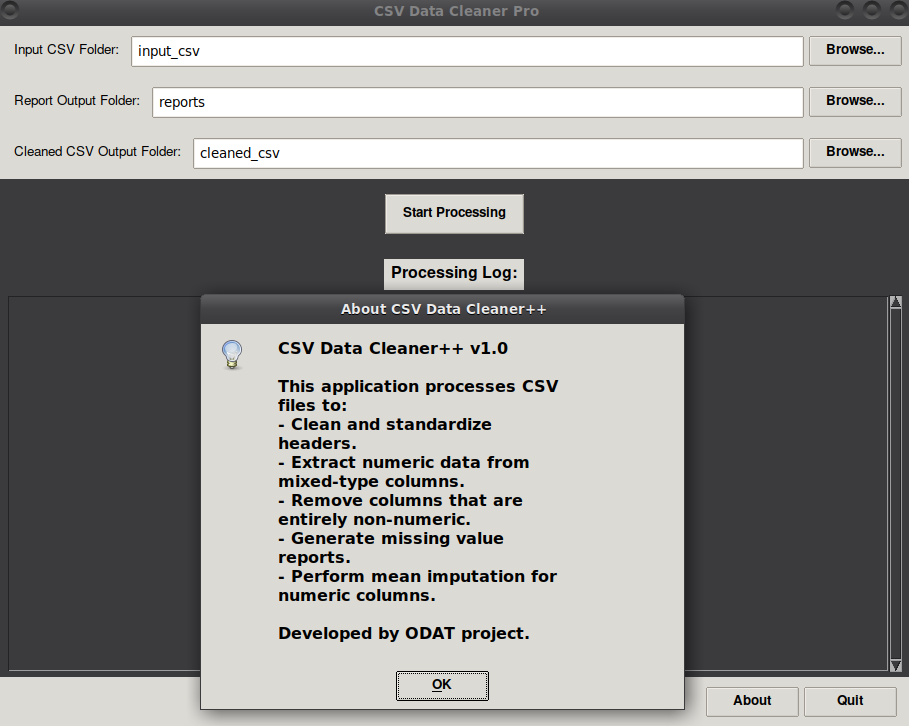

# Tool 8

This GUI application lets you automate the cleaning of CSV files by standardizing headers, extracting numerical data, handling missing values, and generating reports, saving the processed files to a designated folder.

## Description

[Visit odat.info](https://odat.info)

## Screenshot

